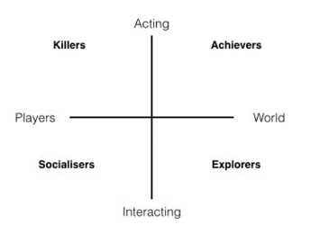
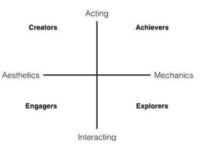
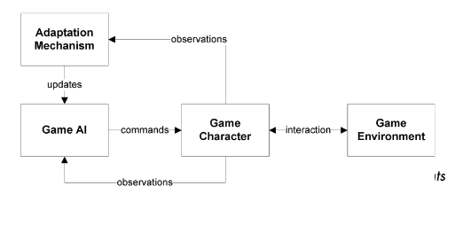
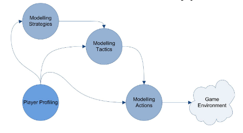

# Samenvatting Game Ontwerp deel 2

## Advances in Game Technology

5 senses:
- Sight     (Displays)
- Hearing   (Speakers)
- Touch     (Haptic feedback)
- Smell
- Taste

### History of displays and VR

1. Braun tube (1897)
2. Cathode Ray Tube
3. PAL (Phase Alternating Line)
4. Sword of Damocles (1968), VR

VR in the 1970's and 1980's was used by research, military and nasa

5. LCD
   1. Flatter, Lighter, Initially slow response time

Results of LCD:
1. Virtuality (Arcade only)
2. Sega VR (never released)
   1. Too slow processor
   2. Too slow screen
   3. Simulation sickness
3. Mobile phones
   1. low cost, high dpi, small form factor screens
4. Oculus

### History of controllers

First: Tennis for 2

Pre-1980
- Pong, Video Pinball, Magnavox Odyssey
- Expensive hardwore
- Single purpose consoles/controllers
- Lots of "pong" clones
- Lots of "wheel" type controllers

1980's and 1990's
- Rise of the multi-game console
- Need for a multipurpose controller
- Joystick (2D)

1990's and 2000's (increased complexity)

1. ATARI 2600 Joystick
2. NES pad (Sticky kamer unit)
3. SNES Controller
4. PS2 DualShock (zoals we m nu kennen)

2000's and 2010's: Motion controllers
- Software is better
- Hardware is cheaper

Now
- VR Controllers
- Touch screens

### Haptics

1. Fonz (1976), TX-1 (1983)
2. Star Fox 64 (1997)
   1. Rumble pak (trillen)
3. Rez (2001)
   1. Trance vibrator
4. Microsoft SideWinder Force Feedback Pro (1997)
5. SideWinder Force Feedback Wheel (1997)
   1. Vibrations, Steering force
6. Force Dimension (2001-present)
   1. Medical, research
7. Novint Falcon (2007)
   1. First Consumer 3D haptic device
8. Disney AIREAL and Microsoft AirWave (2013)
9. Gloves

### Trends and future

#### **Displays**
VR drives screens specs further
- (DPI, Screen door, Resolution, Refresh rate)
AR requires new screen types
- (No passthrough, waveguides, prisms)

#### **Controllers**
Evolution over?
- (Stable design, no obvious improvements)
Hardly used features
- (capacitive touch, motion sensing, force sensing)
Force feedback?
- (vibrations, adaptive triggers)

#### **Haptics**
VR Haptics
- Must interface with different tracking methods
- Be compatible
- Be generic

1. Tactical Haptics (2013)
   1. Reactive Grip
2. Haptic vests
3. Haptic Gloves
4. Omni-Directional Treadmills (walking)
5. Motion Platform/Simulator
6. Ultimatate Battlefield 3 simulator (2011)
   
## Player types & Game patterns

Studies suggest that most players channel their morality into their avatar and would exect others to do likewise.

### User personas
Be as specific as possible about which player experience you are designing for.

1. Different players find different kinds of games enjoyable
2. Different players may enjoy the same game for different reasons
3. Whether or not a game is enjoyable is relative

User Persona is a representation of the goals and behavior of a hypothesized group of users. In most cases, personas are
synthesized from data collected from interviews with users

- Name
- Demographics
- Personality
- Biography
- Motivations
- Goals
- Pains
- Bartle (Social, achiever, explorer, killer)

### Some basics

#### **game patterns**
Certain game patterns foster & encourage distinct types of play behaviour

Examples:
- Competing
- Cooperative play (co-op)
- Self expression

#### **player skill level**

Games are played by people of different skill level, but need to be enjoyable for all level players.

Novice: guide, get used to game machanics, build up difficulty

Expert: provide fresh activities, content or challenges.

### Player types

Two overarching forms of player segmentation:
1. Designer theories
2. Empirical models

#### **Bartle's player types**
1. Achievers
   1. Tend to engage in activities only if it contributes to a particular goal
2. Explores
   1. Try to find out as much as they can about the game environment
3. Socializers
   1. Interested in relatonships with other players and in organizing player
4. Killers
   1. Interested in defeating opponents, causing disruption.

*Idea*: Every person typically exhibits traits from all four types when playing a game, but many people tend to lean more heavily toward one of the types

#### **ACE2 model**
More focus on enjoyment derived from Aesthetics

#### **LeBlanc's taxonomy of game pleasures**
1. Sensation (aesthetics)
2. Fantasy
3. Narrative
4. Challenge
5. Fellowship (co-op)
6. Discovery
7. Expression (creating)
8. Submission
   1. leaving the real world behind

#### **Caillois' patterns of play**
He found most thinking on lay was too much focused on the concept of *competitiveness*

1. Agôn (Competition)
2. Alea (Chance)
3. Mimicary (Simulation or Role Play)
4. Ilinx (State of Dizziness and Disorder)

Caillois imagines each of the four types of games to exist on a continuum between *spontaneous/free play* and *higly structured rule-based play*

#### **The Big Five personality model**

1. *Openness* to experience
2. *Conscientiousness*
3. *Extraversion*
4. *Agreeableness*
5. *Neuroticism*

The extent to which personality is expressed within video game environments, is strictly modulated by the *game mechanics*

#### **Yee's gamer motivation profiles**

Motivation types
- Action
- Social
- Mastery
- Achievement
- Immersion
- Creativity

Three clusters of game motivation:
1. *Action-social cluster*: Excitement, destruction, community, competition
2. *Mastery-achievement cluster*: Completion, strategy, challenge
3. *Immersion-creativity cluster*: Story, design, fantasy

Bridges:
- Discovery
- Power

Link between Big Five
- Higher openness -> higher preference for fantasy, story, design and discovery
- Higher extraversion -> higher preference for excitement, competition and community
- Higher conscientiousness -> weak correlation with strategy preference
  
### Potential biases

#### **Frustration tolerance**
Frustration is typically defined as “an interference with the occurrence of an instigated goal-response at its proper time in the behaviour sequence”
- there needs to be a *goal*
- some type of satisfaction derived from attaining that goal needs to be anticipated

6 main factors that mediate the strenght of the respnse to frustration:
1. The extent to which an individual expected satisfaction from the attainment of the goal
2. The extent to which the goal was blocked
3. The number of in-sequence frustrated responses
4. The legitimacy of the goal block
5. The deliberateness of a block
6. The anticipaton of failure

frustration can cause:
- decreased attention
- reduced memory retention
- reduced learning ability
- decreased motivation to resolve a state of being stuck

#### **Other potential biases**

- Overconfidence effect
- Illusion of control
- Fundamental attribution error
- Peak-end rule
  
## The Moral Significance of Virtual Violence

How do users experience virtual violence?

Hedonic (pleasure) vs Eudaimonic (meaningfulness)

Four propositions

1. Video game characters are automatically perceived as social beings
2. Social beings are deemed worthy of proper moral treatment
3. improper treatment of video game characters may violate norms, trigger **guilt**
4. People enjoy video game violence, because they morally disengage

### Proposition 1

What predicts life perception?
- an object
    1. experience
    2. agency, own will

### Proposition 2 & 3

Life perception -> moral perception

Perceiving experience -> other enjoys moral rights and privileges
Perceiving agency -> other has moral responsibility

More guilt if scenario is unjustified

### Proposition 4

Moral disengagement cues
1. Neglect of consequences
2. Moral justification
3. Dehumanization

### Virtual Reality

Different, because of experience of presence

### Conclusion
Morality in video games increasignly important topic

- Moral disengagement to preserve hedonic
- Moral dilemmas to deepen eudaimonic

## A Motivational Model of Video Game Engagement

### The Motivational Appeal of Violence in Games

many games involve conflict, combat, crime and war. Research on effect of player aggression outside of games has been done

This research on whethter violence played a *motivational* role in accounting for the appeal of games.

Violence itself does not fulfill basic psychologial needs and therefore should not motivate play by itself

But: autonomy due to choices, need for competence due to feedback and relatedness due to team-based challenges.

Three primary hypotheses:
1. expected that the core appeal of violent video games would be based on the experiences of need satisfaction they provided
2. the level of violence in games would relate to intrinsic motivation and immersion in gaming environments only insofar as it was reducible to need satisfaction
3. individuals high in dispositional aggression would opt into and value violent games to a greater extent than people low in trait aggression.

Six studies:
1. Evaluated the motivational appeal of violent game content and experiences of need satisfaction across a broad spectrum of games.
   1. Question: is the level of violence present in a game a consistent motivator?
   2. Prediction: Level of violence could be correlated with motivation, but would not be uniquely linked when basic need satisfaction was accounted for.
   3. Result: Yes, player experiences that supported the autonomy and competence needs related to greater intrinsic motivation, environmental immersion and recommendations for games.
   4. Other result: level of violence was only weakly linked to immersion and was entirely unrelated to intrisic motivation and recommendation
2. Second study
   1. Question: does game violence motivates some people but not others?]
   2. Methode: assessing trait-level aggression
   3. Prediction: play experiences that provided satisfaction of the needs for competence and autonomy would consistently predict intrinsic motivation, environmental immersion and preference for future play, but no expectation that these should relate directly to violence. But highly aggressive individuals would prefer games that embed challenges and choices within settings involving violent graphic imagery and a violent narrative backdrop
   4. Result: Need satisfaction was a consistent motivator of play across all participants, but that those high in aggression exhibited a greater desire to play the violent game in the future despite not enjoying it and that despite low enjoyment, they felt more immersed compared with participant lower in trait aggression.
3. Third study
   1. Goal: establish causal direction for the effects they observed between level of game violence and player preference.
   2. Method: assessment of trait-level agression, and after play assessments of motivational constructs. Randomly assign a high-violence or nonviolent game
   3. Prediction: Need satisfaction would account for game enjoyment, immersion and preference for future play. trait-level aggression would moderate the relation between the level of violence present in game content and preference for play such that those high in aggression would be more likely want opportunities for future high-violence play than low-aggression persons.
   4. Results: Games did not vary in the enjoyment or need satisfaction they provided, and violent content by itself was not significantly related to enjoyment. But those high in trait aggression did report more preference for the violent game.
4. Fourth study
   1. Goal: test the motivating role of game violence
   2. Method: modify the content but not play mechanics of a game. High violence and low-violence version.
   3. Prediction: high in aggression persons like high-violence play more than low-aggression persons.
   4. Results: both versions did not difer in the need satisfaction, enjoyment or immersion they inspired. Variability in these outcomes was based on the in-game competence and autonomy need satisfaction. And trait aggression related to preference for future play only in the high-violence condition.
5. Fifth study
   1. Goal: extending the generalizability of previous findings to experienced players.
   2. Method: assign experienced young male gamers randomly to a violent game with either realistic or abstracted gore.
   3. Prediction: more graphic violence increases game appeal only for those relatively high in aggression.
   4. Result: prediction is true
6. Sixth study
   1. Goal: extending the generalizability of previous findings to experienced players.
   2. Method: survey players about their current favorite video game.
   3. Result: play that supported the basic needs for competence and autonomy produced more immersive and enjoyable experiences relating to greater preference for future play. Level of game violence did not account for the appeal of games.

Findings:

1. Violent content does not by itself contribute to the appeal of games. Most popular violent games motivate engagement for players of subclinical levels of aggression as a function of the competence and autonomy need satisfaction they provide
2. Violent game content did appeal to a subset of players: Those relatively high in aggression.
3. Violent game content can serve to undermine the appeal of games for those with moderate to low levels of aggression.

### Sources of Player Aggression
The empirical study of player aggresson focuses on how the violent content and themes of games can serve as a source of increased aggression postplay, especially among highly aggressive individuals.

interfering with performance in goal pursuit can elicit heightened aggression.

More studies!
1. purpose was to examine how experiences that supported versus undermined mastery of controls influenced short-term shifts in player aggression.
   1. Results: players assigned to play the violent game that featured a more complex control interface experienced lower mastery of controls. In addition, pre- to postplay increases in aggression were in evidence for participants assigned to play both games when they experienced low mastery of controls.
   2. Summary: it was an inability to master the game controls instead of differences in violent game content that contributed to the observed shifts from pre- to postplay aggression
2. Second study examined how the inherent complexity of video game control schemes could increase player aggression entirely independent of contributions of violent game content.
   1. Results: complex interfaces undermindd player competence and fostered increases in aggression. Increased aggression related negatively to game enjoyment for participants assigned to play high- and low-violence games.
3. Third study tested how opportunities to practice with a complex game's control interface before playing shaped how the game influenced short-term shifts in player aggression.
   1. Results: players who felt competent at the game controls felt less aggressive following play. And participants who had time to practice developed greater mastery of controls.
4. Fourth study aimed to test the generalizability of need support versus deprivation as a source of aggression on the between- and within-persons levels in a sample of avid video game players
   1. Results: Results showed that game engagement that supported the basic psychological needs predicted greater game enjoyment and post-play positive affect as well as lower levels of postplay aggression and negative affect

### Having Versus Wanting to Play

There is concern about the overuse of video games and their potential to undermine healthy development. Study done with the aim to explore whether individual differences in basic psychological need satisfaction in everyday life could serve as a protective factor against unhealthy forms of play and need deprivation could serve as a risk factor.

individuals who have their needs for competence, autonomy and relatedness satisfied in daily life would experience more sense of choice about their engagement in video games and would be more likely to play because they *want* to.

individuals with low levels of need satisfaction would feel more compelled to engage games or to report that they often play because they *have* to

**Dualistic model of passion**

Players often engage in computer activities through a *harmonious passion*: Strong inclination to engage that feels consistent with abiding values and motivations.
Some people have an *obsessive passion* for computer activities. Equally powerful motivation to play, but is experienced as a more compulsive and uncontrollable urge to act, and is predictive of more negative outcomes associated with play.

Research: sampled a large number of regular video game players and assessed individual differences in basic psychological need satisfaction, motives for play, mood immediately after play, and overall levels of player well-being.

Results: high levels of need satisfaction -> more harmonious passion for play, more game enjoyment and positive postplay mood.
Low levels of need satisfaction -> obbessive passion for play, less game enjoyment, negative postplay mood, higher overall amount of engagement.

Video game styles may be more a symptom than a cause of psychological distress.
High numbers of hours of video game play were not invariantly related to negative outcomes.

### The Moderating Role of Immersion
Immersion reflects an *illusion of nonmediation* between the player and the gaming context.

Research approach trifurcates the general immersion state into three subcomponents or subscales:
1. *physical presence*
2. *emotional presence*
3. *narrative presence*

the major predictor of presence is the degree to which games satisfy motivational needs. When players have their needs satisfied within the game, they are more phenomenologically embedded in the emotional, physical and narrative elements of the game world.

Study: participants engaged one of two virtual contexts:
- manufactured imagery
- natural settings

Manufactured content led to greater self-focused goals, and natural content was linked to greater prosocial goals. These shifts in interpersonal goals were significantly more pronounced for participants who were highly immersed in teh virtual contexts.

Results from a second study showed that immersion enhanced the link between nature content and prosocial goals because high levels of immersion amplified the extent to which participants felt connected to nature as a whole.

Third study showed that immersion also played a role in shaping actual decision-making behaviour.

Future video game research concerned with disordered play or player aggression should consider immersion as a key moderating construct and assess or manipulate it in the course of inquiry

### Other Perspectives on Video Game Motivation

Uses and gratifications theory: a general framework intended to describe how different media serve as solutions to everyday problems. This theory is used to create a statistically validated taxonomy of the reasons individuals hold for engaging in video games:
1. competition
2. challenge
3. diversion
4. fantasy
5. social interaction
6. arousal

gender-based differences between preferences for some kinds of video games could be explained by differences between the satisfaction players of each gender anticipated deriving from engagement.

Yee identified three overarching motives for in-game behavior:
1. achievement
2. socializing
3. immersion

Female players placed greater emphasis on the socializing and immersion motives, male players considered achievement motives most important.

Yee's models is based on a set of motives deduced from the affordances multiplayer online games currently provide, and SDT model focuses on the fundamental psychological needs that such motives may or may not tap into or satisfy.

### Limitations
Video games are a relatively new application for SDT.
Future empirical studies will hopefully bring a wider range of methods, including more extensive use of experience sampling, more differentiated samples, third-party data sources, and longer term longitudinal studies.
### Future Directions
One interesting avenue for future research could focus on how specific game features influence basic need satisfaction.
Another important avenue for future research is concerned with the potential of need-satisfying games to enhance learning and promote healthy behaviors.
A third route for future research would focus on how need satisfaction derived from games compares with needs met in other domains.

Concern-focused research concentrating  on violent video games:
1. chronically aggressive individuals might have some person-level vulnerability that disposes them to seek out other violent media in ways different from the population at large
2. acute spikes in player aggression are based on need frustration, and the use of different games to represent high- versus low-violence play experiences can introduce highly problematic confounds
3. the moderating effect of immersion on links between virtual content on real-world outcomes suggests that the inconsistencies in laboratory studies of violent game content on aggression may be unified through assessing and manipulating player immersion

## AI & Video Games

### Have video games *changed* throughout the past two decades?
Yes, much prettier now (graphics enzo)

What is needed to evoke the *illusion* of natural behaviour in games?
- No obvious cheating
- Variety
- Avoiding stupidity
- Using the environment
- Self-correction
- Artificial creativity

### Challenges for *Artificial Intelligence* in video games

Classic challenges for AI in video games
- vast state-space complexity
  - How bigger the game, the more states there are
- vast action-space complexity
  - The more states, the more actions you can do.
- Game-theoretical classification
  - Hundreds of distinct entities, who modify game state asynchronously, and whose decision models are unknown
- Dynamically changing environment
- Decision making under severe time constraints.
  - Decisions have to be made real-time, under severe time constraints.

Classic AI tech no longer worky

### *Learning* what to do, how to respond, etc.

**Tricks and Cheats**
- Establish the illusion of intelligent behaviour

**Scripts**
- Static, long, complex and prone to programming mistakes
  
**Incremental adaptive game AI**

**There is a catch...**
AI can learn effective behaviour for *many* video games,
but learning *during* actual gameplay
1. requires an inconventiently large number of trials
2. is generally computationally expensive
3. usually generates many inferior solutions before coming up with a good solution

Goal = learning how to *entertain/motivate* the individual human player

### *Learning* who the human player is

Types of **Player Modelling**

We have AI that (1) can learn adequate behaviour, and (2) can model the human player; *now what?*

### Creating *personalised* game experiences?
A personalised game is a game that utilises player models for the purpose of tailoring the game experience to the individual player.

**Motivation**
1. psychological foundation
2. effect on player satisfaction
3. contribution to game development practise
4. instrumental to achieving industry ambitions

Player models
- Game mechanics adaptation??
- Mission adaptation
- Space adaptation
- character adaptation
  - e.g. behaviour, appereance
- narrative adaptation
- music adaptation

**Goal**: assessing *on-demand*, *just-in-time*, and *unobtrusively* which game adaptations are required for optimising the individual player's experience.

**Game personalisation**
1. Learn a *feedback model* from actual gameplay sessions
2. Employ the model for decision making at run-time

**Results**
1. Approach learns appropriate challenge level within ~30 secs.
2. Game adaptations can be made specifically to certain game content
3. Human participants consistently prefer the personalised game over an identical static game.

**Can we do effective game personalisation from solely *Facial Expression Analysis***

findings:
1. Rapid gameplay optimisations is feasible
2. under controlled conditions, human participants consistently prefer the personalised system
3. There is no such thing as controlled conditions for the home user of a video game
4. Facial expression analysis for games can be made more accurate by *tracking gaze* and *head movement*

### Automated game design!

1. Mission Sketch
2. Mission Structure with required Rooms
3. Spatial Construction
4. Actual Game Space

Can we replace the Game Designer with an Algorithm?
- No; Our AI is not good enough yet
- No; there will always be a need for human supervision
- Yes; Lots of repetitive and low skilled design tasks will become automated
  
## UX Design in Video Games

### Common misconceptions

**UX is making good UIs**

Instead, UX encompasses *all* aspects of game design
- Controller input
- Signposting in level
- Look and feel of weapons
- Designing UIs
  
**Good UX should make things easier**
Ux should **not** alter the intended challenge

**Anyone can do it it's so obvious!**
Good UX is:
Easy to understand, difficult to design

### User Experience Design
What is User Experience Design (UX)?

UX tries to improve the relation between human and technology, and encompasses the following fields:

- Usability
- Interaction
- Visuals
- Information structure

Main goal of UX in games:
*Making games more fun, but in specific ways.*

In games *usability design* is about giving the players the tools to achieve their goals.

What to do:
1. Read about design principles
2. Do **usability testing**

### UX Design Principles
A design principle is a concept in UX where the design consequences are well understood.

1. Affordance
   - The physical shape of an object tells about its function
2. Mapping
   - The relationship between controls and their effects should be clear.
3. Nudging
   - Modifying behaviour based on known psychological principles.
4. Progressive Disclosure
   - Hiding information to avoid overwhelming the player, and make choices more meaningful
5. Conventions
   - The user's experience is based on prior knowledge and experience
6. Proximity
   - Grouping objects trumps differences in color.
7. Visuospatial Resonance
   - Different features of an image are visible at different distances.
8. Anticipation
   - Correct timing makes weapons, spells and abilities more satisfying to use.
9. Feedback
   - User input should be met with an appropriate response

### Usability Testing
Allow *other* people to play your game while you observe *inconspicuously*

The mantras:
- You don't know what your player needs
- accept criticism
- minimize experimenter bias
- don't make me think
- there is no panacea (one solution to all problems)

Developer phase
- be critical
- get rid of obvious bugs
- prefer *signposts* over crashes

Usability Testing phase
- Observe them playing the game, while thinking aloud.
- Emphasize player can't make mistakes/doesn't need to win

Alpha phase
- Have something in place for the players to give immediate feedback
- Start collecting metrics.

Beta phase
- Focus on metrics
- *expectation management*

### Conclusion
- UX enxompasses the whole design of the game
- UX tries to bridge the player and the game
- UX requires Usability Testing

## User Retention & Games as a Service

### Literatuur

## Player Experience Modeling

### Literatuur

## Achievements in Video Games

