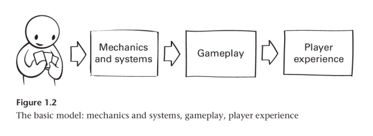
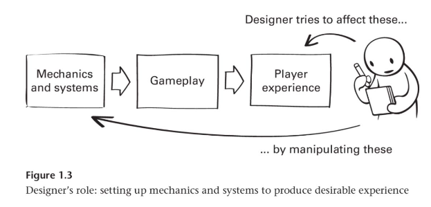
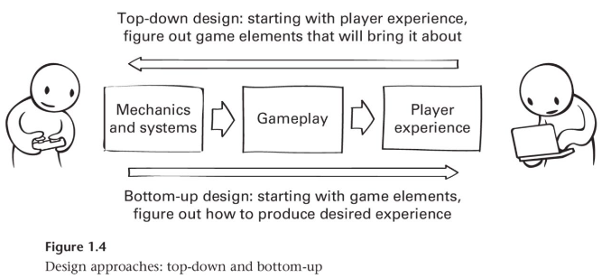
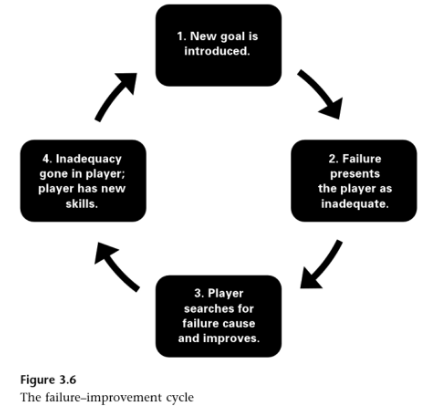
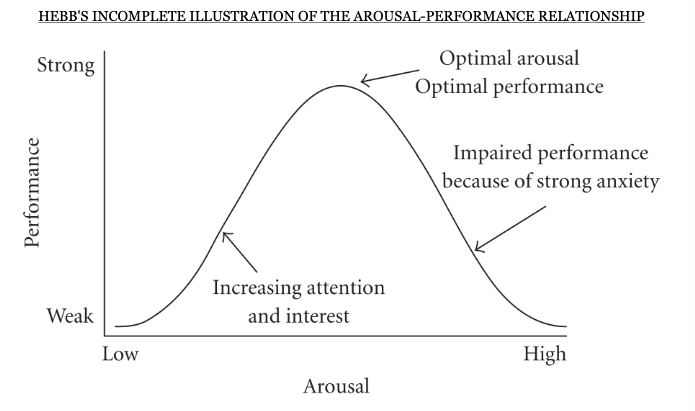

# Samenvatting Game Ontwerp deel 1

## 02 - User-centered Game Design

### Game design models

#### **Affirmative Design**

improve or dress up past succes

#### **Critical Design**

Critical design aims to critique the traectory of certain game design patterns.
Tries to offer an alternative that responds to a trend.

#### **Playcentric Design**

decanteren en itereren tot je beste versie van je game hebt

#### **MDA**
Mechanics, Dynamics, Aesthetics. Frame de design keuzes tussen player experiences en designer intenties.
Nu MGP Framework

### MGP Framework
#### **Logic**
1. Players interact with different game *objects* and perform various *actions*
2. Interacting with the game and other players over time creates
*gameplay*.
3. Gameplay gives rise to specific *experiences* and *feelings* in each
player

#### **Design approaches**
1. Top-down design
   - Player Experience -> Mechanics
2. Bottom-up design
   - Mechanics -> testing -> desired player experience
   - 

### User personas
Capture who our users are, in detail, as people living their daily lives, and imagine why and how they would want to play the game.

### Flow in Games (and Everything Else)

People seek personal happiness and pleasure.
Flow represents the feeling of complete and energized focus in an activity, with a high level of enjoyment and fulfillment.

eight major components of Flow:
- A challenging activity requiring skill;
- A merging of action and awareness;
- Clear goals;
- Direct, immediate feedback;
- Concentration on the task at hand;
- A sense of control;
- A loss of self-consciousness; and
- An altered sense of time

In order to maintain a user's Flow experience, the activity must balance the inherent challenge of the activity and the player's ability to address and overcome it.

In order to design an interactive experience for a broader audience, the experience cannot be the same for all players or users, so many choices have to be offered.

design should follow a four-step methodology:
- Mix and match the components of Flow;
- Keep the user’s experience within the user’s Flow
Zone;
- Offer adaptive choices, allowing different users to
enjoy the Flow in their own way; and
- Embed choices inside the core activities to ensure
the Flow is never interrupted.

## 03- Player Motivation: The Art of Failure
*What motivates people to (keep) playing video games?*

### The Art of Failure
People prefer playing games in which they fail.

*paradox of failure*
1. We generally avoid failure,
2. We experience failure when playing games,
3. We seek out games, although we will experience something that we normally avoid

failure is a *motivator*

### Goal Blocking
blocking in games is expected an acceptable behaviour.

### Attribution theory
We try to attribute events to certain causes:
- Person
- Entity
- Circumstances

three dimensions of how we deal with failure:
1. Internal vs. External
2. Stable vs. Unstable
3. Global vs. Specific

### Feeling responsible for outcomes...
Players rate the game significantly higher when they felt responsible for failure than when they did not.

Failure-improvement cycle:

### A panorama of Play - A literature review
#### *Children's perspective on play*
From children’s perspectives, play is
important for their enjoyment of life and what it means to be a child in the here-and-now

children's own concepton of play is activities where freedom and agency is high with minimal adult involvement. 'free play'

Risk-taking is a common feature of children's free play.

Children’s play has its own culture that is different and distinct to that of adults, and
which adults may have trouble accessing or understanding

#### *Theorising the value of play*
play is often still regarded as the opposite
of work, with playtime only earned when work is complete.

three main societal orientations to play:
- culturally curtailed
- culturally accepted 
- culturally cultivated

*Play as valuable for development*

Spencer: let off steam by playing after completed tasks
Groos: play as preparation for later life.

free play is seen as providing children with
greater opportunities to use their imagination, be creative and experiment 
## 04 - Player Motivation: Psychological Theories
*what motivates people to (keep) playing video games part two*

Design considerations by Hugo Martin:
- pushing you into a more fun style of play
- not doing the same thing again and again
- get the player to move
- when you are thinking you are engaged, and when you are not thinking, you are bored.

### Theories on Intrinsic Motivation

Intrinsic motivation: *When the player is inherently interested in the activity and its outcome*

#### **Valence & arousal**
low arousal in goal-directed activities, high arousal in activities performed for their own sake.

#### **Flow Theory**

Three conditions:
1. A clear set of goals
2. Balance between challenges and user's abilities
3. Clear and immediate feedback

### Self-Determination Theory
Research demonstrates that activities foster greater intrinsic motivation to the extent to which they satisfy three fundamental human needs:

1. The need for *competence*
2. The need for *autonomy*
3. The need for *relatedness*

individuals who have their needs for competence, autonomy, and relatedness satisfied in daily life would experience more sense of choice about their engagement in video games and would be more
likely to play because they want to, instead of *having* to

### Mood-Management Theory
We choose entertainment in part because we want to *control our mood*

#### **Extrinsic motivation**
extrinsic motivators often focus on rewarding actions/progression

*Ethical*
- rewards
- high score
- feedback from game designer
  
*Unethical*
- encouraging players to focus on extrinsic rewards over their intrinsic motivations

Types of Reward Schedules
- continuous
- fixed interval
- fixed ratio
- variable interval
- **variable ratio**

And loot boxes are bad

### **A motivational model of video game engagegment**

First research in video games concern-focused, now intervention-focused.

Research approach in this article is based on *self-determination theory*

#### **Motivation and Video Games**
Video games motivate a remarkable amount of goal-directed behaviour.
Video game play differs from activities that are engaged in some form of external reward.

The appeal of video games lies in the inherent properties of the experiences they provide.

activities foster greater intrinsic motivation to the extent to which they satisfy three fundamental human needs: the need for *competence* (sense of
efficacy), *autonomy*(volition and personal agency), and *relatedness* (social connectedness).

Compared with those pursuing an activity for extrinsic reasons intrinsically motivated actors enjoy the activity more, are more creative, demonstrate more cognitive flexibility, process information more carefully and completely, and incur greater psychological and physical health benefit.

#### **Psychological Need Satisfaction in Video Gaming Contexts: A Historical Look**

a brief historical
review suggests that since their inception video games have increasingly tapped into the basic psychological needs specified within SDT. First competence, then autonomy and relatedness.

#### **Competence Need**
*Galaga, Pong and Donkey Kong*
The pacing of challenges was designed so players could continually experience enhanced competence as they progressed in the game, with challenges increasing apace with player ability.

In addition to deriving new ways to balance challenges with ability, games have become more sophisticated in how they provide performance feedback and acknowledge the prowess of players.

#### **Autonomy Need**
*Final Fantasy, The Legend of Zelda, and Adventure*
a wide range of in-game choices over goals and strategies and varied opportunities for action.

By enabling players to advance through different game challenges, allowing them to form and break alliances with nonplayer characters, players were empowered to shape the game's narrative.

#### **Relatedness Need**

Social interaction has always been an important part of video game play, both in arcade setings and home console games.

Modern incarnations of multiplayer games give players connected to the Internet access to a central virtual wordl that provides opportunities for both competitive and cooperative group play.
Short-term and long-term.

#### **Mastery of Controls**
One key characteristic that distinguishes real-world from gameing contexts is that the latter lack physical substance.
Two practical implications for the study of human engagement and motivation in games:
1. Player actions are mediated through a control interface
2. Player actions cannot readily capitalize on the sense of proprioception as a source of control and feedback.

*Mastery of controls* is the learned ability to effortlessly perform intended actions in the game's virtual environment.

Video game players and
designers refer to the process of acquiring mastery of controls using the term *learning curve*.

Complex controls and mechanics: Steep learning curve.

#### **Research on Need Satisfaction in Games**
the researchers designed and validated measures of need satisfaction within video game contexts that they called the *player experience of need satisfaction*.

They formulated and tested three main hypotheses in the initial research.
1. need-satisfying experiences within video game play would contribute to:
   1. intrisic motivation for play
   2. immersion in gaming environments
   3. positive short-term shifts in player well-being
2. motivational affordances provided by games underlie their appeal over and above the content of games and individual differences
3. mastery over game controls and mechanics was necessary to access need-satisfying opportunites provided by games, but an intuitive grasp of ame interface is not a sufficient condition for enhancing player motivation or well-being.

## 08 (Interactive) Storytelling in Video Games
