# Reasoning under uncertainty

## Bayesian networks
### je kent het verschil tussen kans, kansverdeling, voorwaardelijke (conditionele) kans en voorwaardelijke kansverdeling : 

Kans is kans, kansverdeling is golfje, conditionele kans is kans dat iets gebeurd op voorwaarde dat, en voorwaardelijke kansverdeling is de kansverdeling van de voorwaardelijke kans.				 

### je kent de kans-axioma’s en kan die toepassen : 

For any propositions a, b: 

– 0 ≤P(a) ≤1 

– P(True) = 1 and P(False) = 0 

– P(a ∨ b) = P(a) + P(b) -P(a ∧ b) 

En P(a) = 1 -P(¬ a) 

### je kent de definitie van voorwaardelijke kans en kan die toepassen  

P(x|y)=P(x ∧ y) / P(y) (assumes P(y) > 0 !)

### je kent de volgende rekenregels en kan die toepassen: product regel, regel van Bayes, kettingregel (chain rule), marginalisatie regel: 

product regel: P(x1 ∧ ...  ∧ xn)  = P(x1 | x2 ∧ ... ∧ xn) P(x2| x3 ∧ ... ∧ xn) ... P(xn-1| xn) P(xn)

Regel van Bayes: 

ketting regel:  P(a ∧ b) = P(a|b) P(b) = P(b|a) P(a)

marginalisatie regel: 

### je kent de definities van (conditionele) onafhankelijkheid 

twee variabelen zijn onafhankelijk als : P(X = x|Y= y) = P(X = x) voor alle waardes van X en Y

als X en Y onafhankelijk zijn dan:  P(X,Y) = P(X|Y)P(Y) = P(X)P(Y)    for all values of X and Y

In general, if X1 ,..., Xn are independent, then

- P(X1 ,..., Xn)= P(X1)...P(Xn)          for all values of Xii=1,...,n

Two variables X and Y are _conditionally independent_, given Z if
- P(X = x|Y= y,Z=z) = P(X = x|Z=z)for all values x,y,z

### je bent bekend met de syntax en semantiek van een Bayesiaans netwerk, kent de formule voor de kansverdeling (joint distribution) gedefinieerd door een Bayesiaans netwerk  

een bayesion netwerk bestaat uit:

1. Directed Acyclic Graph (DAG)
2. A set of _tables for each node_ in the graph, representing conditional probability distributions
   
DAG: 

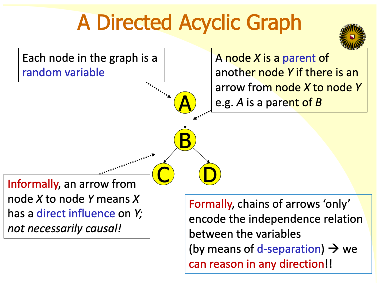

A set of tables for each node:

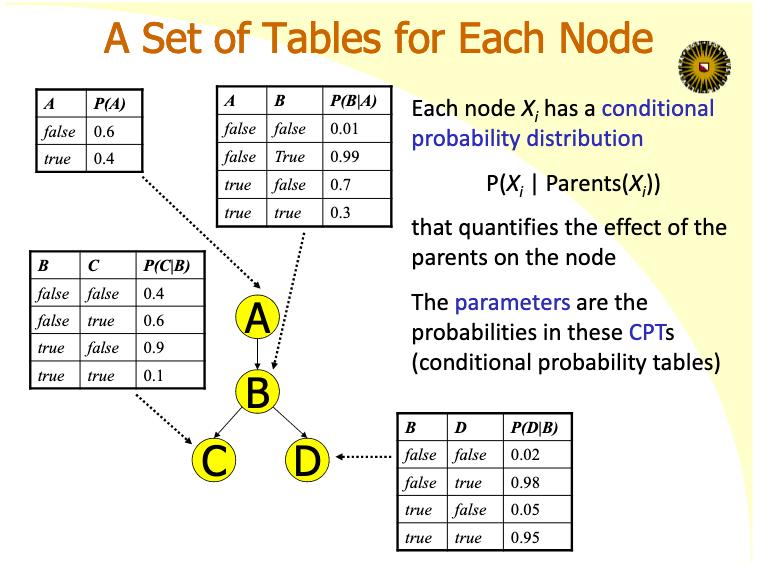

Semantiek:

1. Encodes the conditional independence relationships between the variables in the graph structure
2. Is a compact representation of the joint probability distribution over the variables
   
formule voor de kansverdeling gedefinieerd door een Bayesiaans netwerk:

### je kan kansen uitrekenen uit Bayesiaanse netwerken  

voorbeeld:

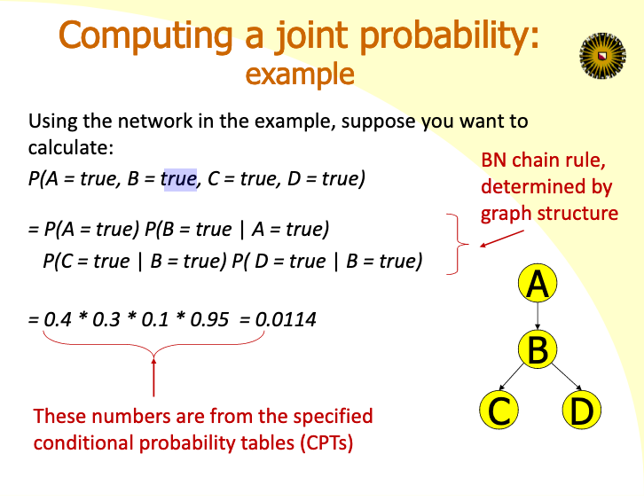

### je kent de complexiteit van inferentie (=kansen uitrekenen) in Bayesiaanse netwerken:

Exacte inferentie is NP-hard. Feasible in small to medium-sized networks

### je weet wat een Naive Bayes classifier is (NBC), hoe die werkt, wat de relatie met een Bayesiaans netwerk is, en kan de bijbehorende berekeningen uitvoeren:

wat is het:

een NBC specifies:

- a class variable C
- feature variables F1,...,Fn
- a prior distribution p(C)
- conditional distributions p(Fi|C)

laatste twee kunnen door frequency counting.

Dus weer tellen hoeveel ja, hoeveel nee, en dan binnen die ja ook weer verdelen. Hier voorbeeld:

## Fuzzy logic and interference

### je kent het verschil tussen fuzzy en crisp sets, en de notaties voor fuzzy sets:

Crisp: harde lijnen, dingen zijn zoals ze zijn.
Fuzzy: multi-valued, degrees of membership en degrees of truth. accepteert dat dingen waar en niet waar tegelijkertijd kunnen zijn. (sigmoid, gaussian and pi)

notatie fuzzy (sub)set:

### je kent voor- en nadelen van het gebruik van fuzzy logic/sets  

voordeel: niet strakke lijn. 
Nadeel: moeilijker  om te programmeren
### je kent het verschil tussen fuzzy rules en ’klassieke’ rules 	

verschil fuzzy en classical:

### je kan membership functies interpreteren 						 
membership functie:

### je (her)kent de verschillende operatoren op fuzzy sets (voor de standaard operatoren moet je ook de formules kunnen geven) en kan ze toepassen 			

operatoren:

- complement   /negation (min and max) 

- intersection /AND

- union        /OR

- containment  /implication

- equality

- cardinality

- empty set

### je kent de operatoren die fuzzy sets op crips sets afbeelden (core, support, alpha-cut), en kan die toepassen 							 
Alpha-cut:

Core en support:

### je kent de vier stappen van Mamdani fuzzy inference en kan die toepassen 		

vier stappen van Mamdani:

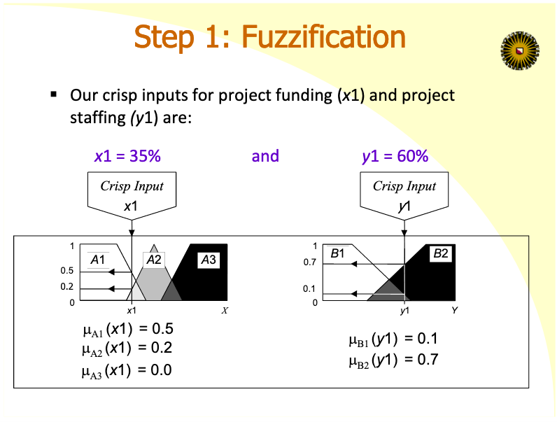

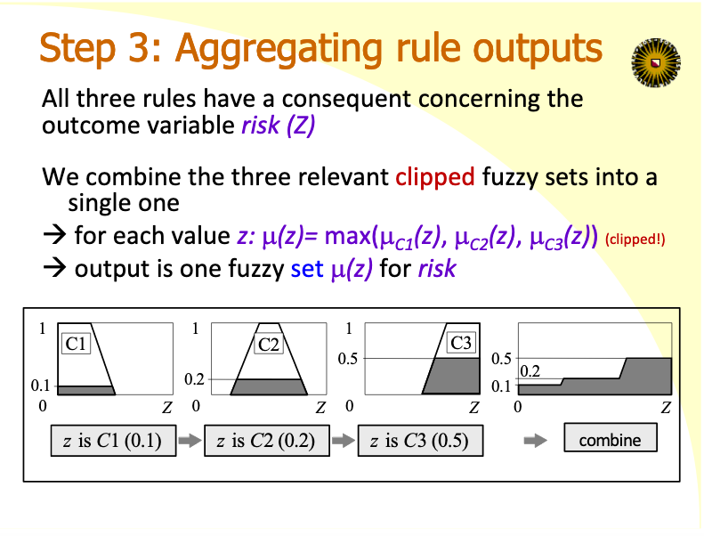

### je kent de verschillende methoden voor rule evaluation (clipping en scaling) en kan die toepassen  

clipping:

scaling:

# Classical/Deterministic planning

### je kent de kenmerken van classical planning
goal oriented behaviour

### je weet het verschil tussen lineaire (non-interleaved) en interleaved (hierarchische) planners, en snapt hun globale werking

A linear planner is a classical planner that assumes:

- no distinction between importance of goals
- all (sub)goals are (assumed to be) independent

As a result, plans that achieve subgoals are combined by placing all steps of one subplan before or after all steps of the others  _(=non-interleaved)_

Hierarchical planner: 

- explicity views plans as a partial order of steps. Add ordering into the plan _as needed_ to guarantee it will succeed.
- 
### je kent de Sussman anomaly en weet wat die illustreert
probleem met non-interleaved planning. planner kan niet het ene doel doen zonder het andere subdoel te undo-en

### je weet wat STRIPS is, kan eenvoudige acties in STRIPS-syntax definiëren en kan voor zeer eenvoudige voorbeelden een plan maken zoals dat mbv goal-stack-planning gevonden zou worden
idee van STRIPS:
Idea: 

- State(or world model) represents a large number of facts and relations
- Use formulas in first-order logic
- Use theorem-proving within states, for action preconditions and goal tests
- Use goal stack planning for going through state space

Actions:

- Preconditions(list of predicates that should hold)
- Delete list (list of predicates that will become invalid)
- Add list (list of predicates that will become valid)

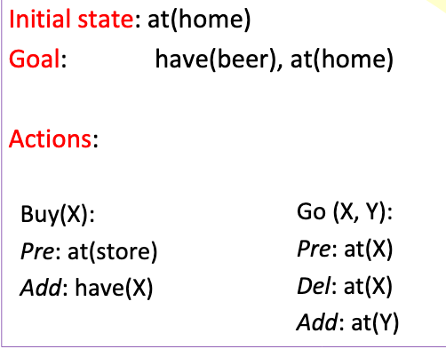

Goal stack planning:

### je weet wat het frame probleem en het ramification probleem is, inclusief de oplossing in STRIPS

#### Frame problem:

How can we efficiently represent everything that hasn't changed?

STRIPS solution for simple actions: 

- every satisfied formula not explicitly deleted by an operator continues to hold after the operator is executed

#### ramification problem:

Do we want to represent every change to the world in an action definition?

STRIPS solution: 

- some facts are inferred within a world state
    - e.g.the number of people in the store
- ‘inferred’ facts are not carried over and must be re-inferred
    - Avoids making mistakes, perhaps inefficient.
  
### je kent overeenkomsten en verschillen tussen STRIPS en GOAP, en weet wat insistence en discontentment is, en hoe je dat laatste berekent
GOAP (goal oriented action planning): 

- Goals can be seen as motives for taking action
    - Example goals: Eat, Sleep, Kill
- __Priority__ for fulfilling goals is given by _insistence I_  
    - Example: goal g = Eat I(g) = 4   (I E {0,...,5}, 5 highest)
- Actions specify to which goal they contribute and how they affect insistence
    - Example:  Action: get-food: I(Eat) <- I(Eat - 3)
- Different action-selection methods possible

Discontentment:

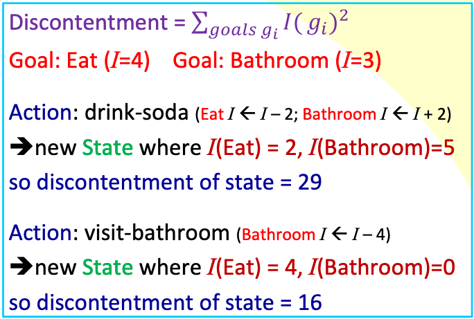

### je kent de globale werking van NOAH, weet wat de afkorting betekent, en weet wat de critic doet

NOAH: net of action hierarchies

1. split into subgoals, which should be joined
2. identify conflicts (_critic_ does that)
3. resolve conflicts
4. simplify

### je kent heel globaal de werking van HTNs in het algemeen en SHOP in het bijzonder, en weet wat de afkortingen betekenen

HTN: Hierarchical Task Networks:

- Capture hierarchical structure of the planning domain
- Planning domain contains non-primitive actions (tasks) and schemas for reducing them 
- Reduction schemas:
    - given by the designer
    - express preferred ways to accomplish a task

HTN planning algorithm:

Problem reduction:
1. Decompose tasks into subtasks
2. Handle constraints (binding, ordering,...)
3. Resolve interactions
4. If necessary, backtrack and try other decompositions

SHOP: Simple Hierarchical Ordered Planning

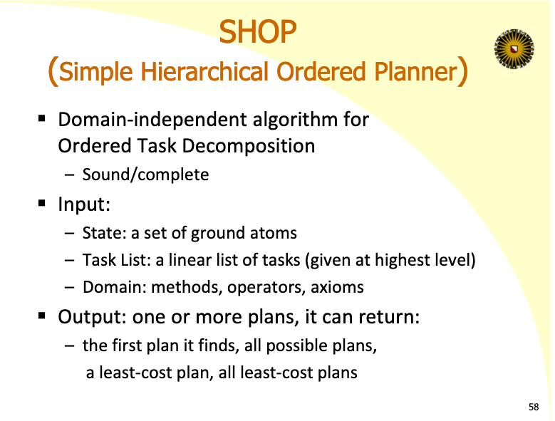

### je kent, voor zover behandeld, de performance measures van de verschillende algoritmen

strips: incomplete, not optimal

# Decision Making

### je weet wat reactive planning is
reactive planning:

- Cope with dynamic and unpredictable environments
- Compute just one next action every instant
- Sometimes use stored info on agent’s priorities and behaviors
- Typically used in real-time: 
    - decision -> immediate action
  
### je kent de semantiek en eigenschappen van de behandelde varianten van beslisbomen,FSMs en behavior trees en weet waarom ze zo heten

#### Decision trees:

#### FSM:

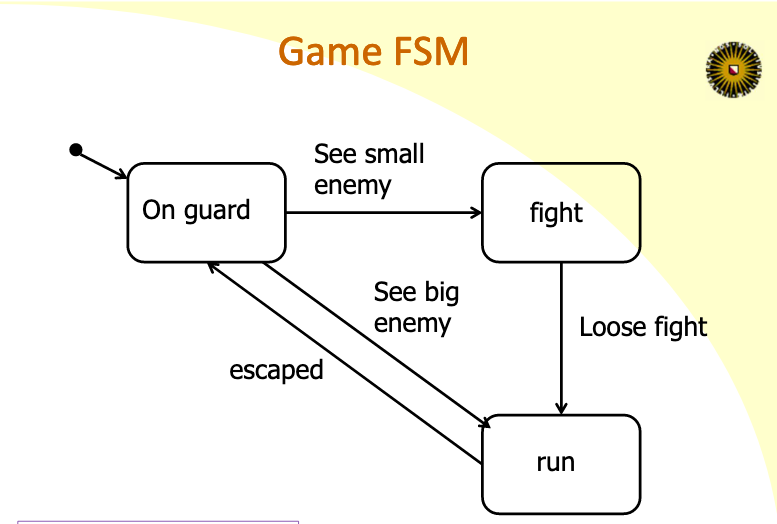

FSM states:

- States: should be disjunct, cover of all possible situations
- Activities: should be “evenly divided” over states
- Activities: should be “naturally” divided over states
- Difficulties when a character can be in more than one state at the time...
  

#### Behavior trees:
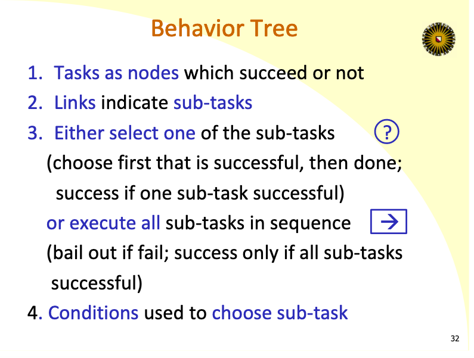

### je weet hoe regelgebaseerde systemen werken: wat doet forward/backward chaining, wat is matching, wat zijn methoden voor rule arbitration, wat doen ze en waarom zijn ze nodig, etc

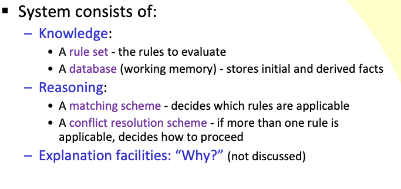

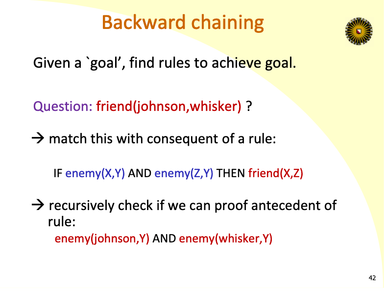

Rule arbitration:
Decides which rule to fire when several are triggered.

Possible mechanisms:

1. Order of rules: take first that triggers
2. (dynamic) Priorities (time consuming!)
3. Specificity: most specific condition 
4. Recency: least recently used
   

### je kan forward/backward chaining toepassen, maar hoeft dit niet volgens het Rete algo- ritme te kunnen; wel moet je bekend zijn met de globale werking van het Rete algoritme

kijk hiervoor maar in de slides.

### je kent voor- en nadelen van de verschillende formalismen en kan ze met elkaar vergelijken

Rulebased system: properties

Advantages

- Corresponds to way people often think of knowledge
- Very expressive
- Modular knowledge (rules)
    - Easier to write and debug, compared to e.g.decision trees
    - More concise than e.g.FSM
  
Disadvantages

- Can be memory intensive
- Can be computationally intensive
- System as a whole difficult to debug 
    - (are rules consistent with each other?)
  
### net als voor de andere zoekalgoritmen ken je de eigenschappen en performance measures voor mini-max

Compute value of perfect play for deterministic, perfect information games

- Traverse game tree in DFS-like manner
- ‘bubble up’ values of evaluation function: maximise if my turn, minimise for opponent’s turn
  
Serves for selecting next move: choose move to position with highest minimax value = best achievable payoff against best play

May also serve for finding __optimal strategy__ = from start to finish my best move, for every move of opponent.
(useful for agent design)

### je weet hoe mini-max en alfa-beta pruning werken en kan dit toepassen, en een optimale strategie bepalen

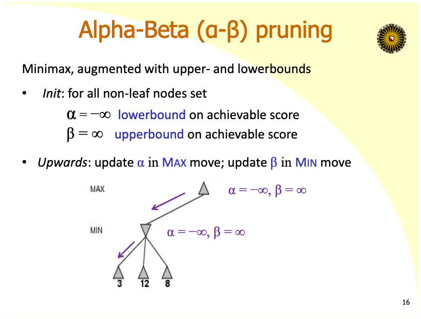

### je bent bekend met de behandelde begrippen uit de speltheorie en kan ze toepassen

zie lecture 14 als hier een vraag over komt

# Tactics, coordination en motion

### je kent het nut van het gebruik van waypoints voor tactische analyses

Features of waypoints:

- Cover
- Shooting range
- Exposure
- Fleeing possibilities
- Wetness
- Heat
- Space available

Waypoints conclusion: 

- Keep it simple
- Waypoints can be used to provide info that can be calculated off-line (waypoints can carry numerical info)
- More dynamic features either give overhead or are already outdated!
- Balance between keeping info in waypoints and having it calculated by characters
  
### je weet wat influence maps zijn en waarvoor die gebruikt kunnen worden

- Method for (runtime) spatial analysis
- Matrix representing the game world
- Each cell stores data for one aspect of that part of the world  (map/level per aspect, map of combinations?)
- Values of nearby cells are determined by propagation
-> Map shows the influence of certain objects on each part of the world

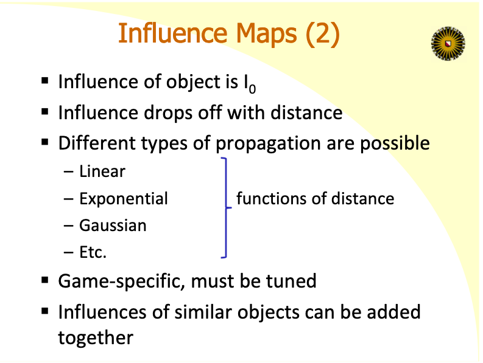

### je kan, gegeven de influence van objecten en een ’drop-off’ functie, invloeden in een map propageren

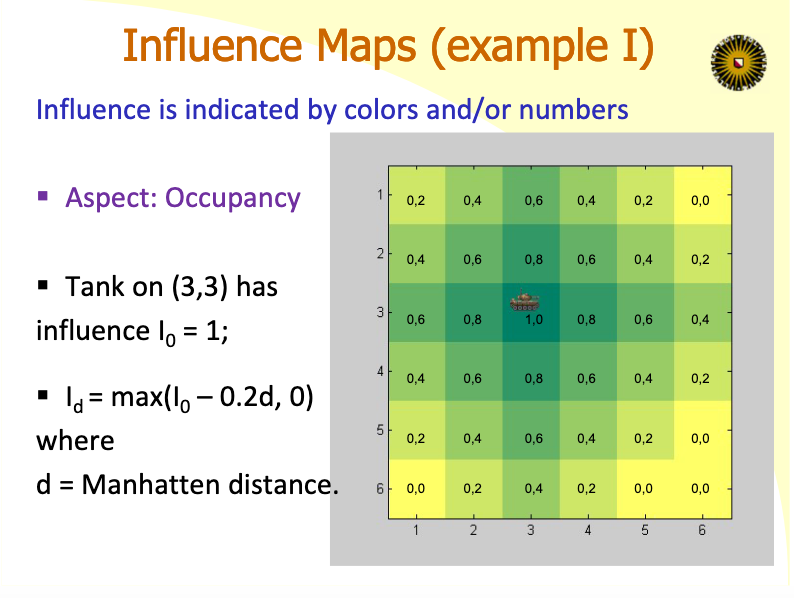

### je kan de invloed van verschillende aspecten combineren in een desirability layer en op basis van de gevonden waarden een beslissing nemen (bijv optimale route)

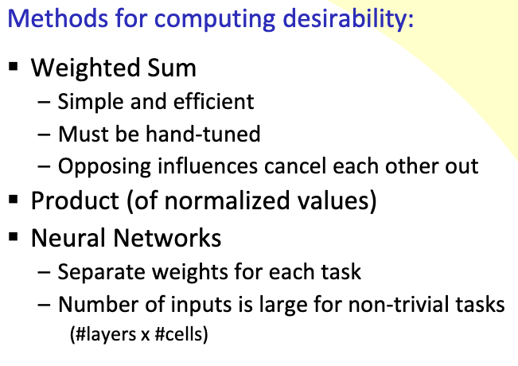

### je begrijpt de werking van eenvoudige cellulaire automaten en hun mogelijke rol in het gebruik van influence maps

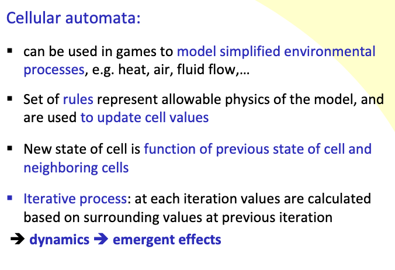
### je kent voor- en nadelen van het gebruik van influence maps

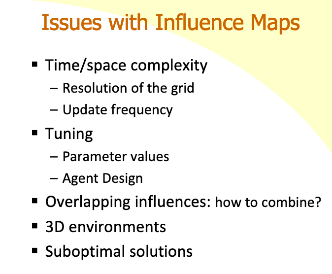
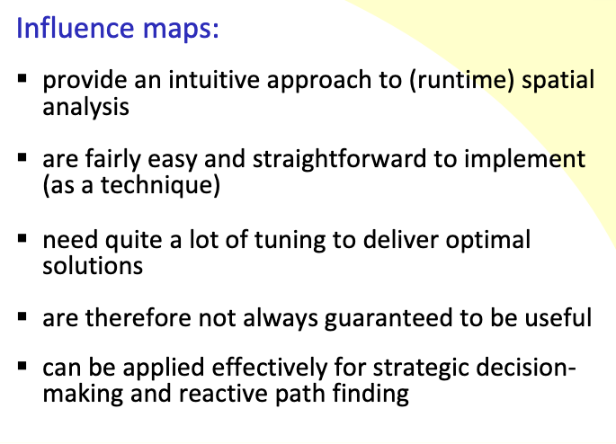

### je kent verschillende manieren van het coördineren van groepen en de voor- en nadelen hiervan

1. Fixed patterns

- Problems:

   1. stay in formation
   2. obstacle avoidance
   3. bump into other members when turning

2. Emergent patterns
   
- Problems:

   1. Get the right pattern for the right situation
   2. Find the “right” rules to create formation
   3. Set the parameters

3. Two levels + anchor

- Problems:

   1. Lose the leader
   2. Anchor point of pattern should be in center of formation

4. Formations with roles

- Problems:
  
  1. Get the right character in the right slot
  2. Slots might be situation dependent (e.g. where is the enemy)

### je weet wat het idee van scripting group actions is en begrijpt waarom timing daar belangrijk is

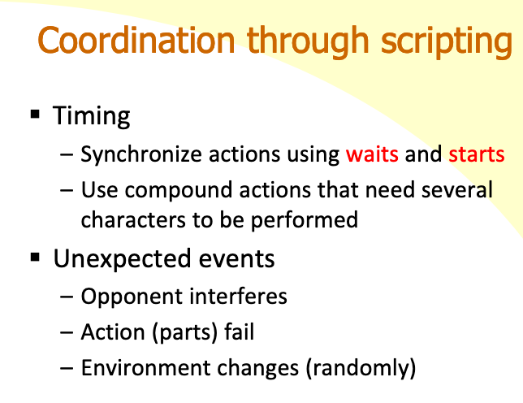

### je begrijpt het verschil tussen teamwerk en coördinatie (Convoy example)

### je kent het globale idee achter SharedPlan en weet waartoe het dient

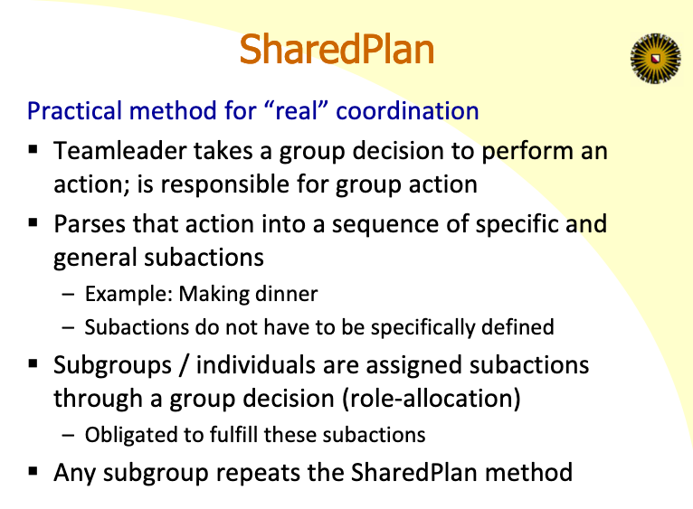

### je kent de globale werking van alle kinematic movement algoritmen en steering be- haviours (je hoeft geen code te kunnen reproduceren), je kent de verschillen, en kan voor- en nadelen ervan bedenken

- Seek
- Flee
- Arrive
- Wandering
  
### idem voor verschillende soorten path following

### je weet het verschil tussen collision detection (pure detectie) en collision avoidance (steering) (hoewel dit onderscheid niet altijd strict gemaakt wordt), en de voor- en nadelen van verschillende detectie methoden

### je weet het verschil tussen collision avoidance (typisch voor bewegende targets) en obstacle avoidance (typisch voor niet-bewegende voorwerpen) (hoewel ook dit onderscheid niet altijd strict gemaakt wordt)

### je kent globaal de methoden voor het combineren van steering behaviours
### je kent globaal de methoden om jumping mogelijk te maken, met voor- en nadelen

